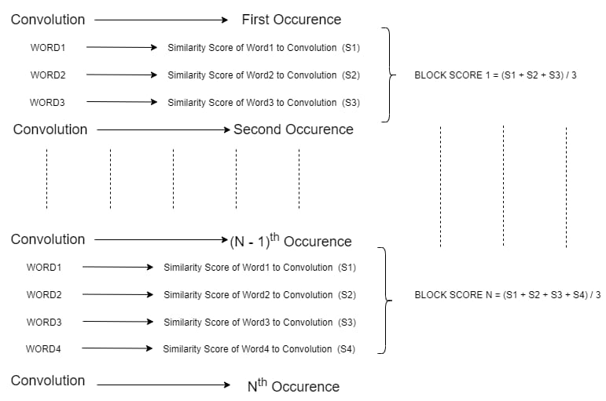

# hackoffv2

## Team Py_ino 


### Description 

``` Online learning has undergon a huge paradime shift in the past few years.```

> There are so many videos on platforms like youtube, coursera, etc where videos are made at huge rates. 

` Many people have resorted to this form of informal education as it is easier to follow up but also can determine the pace of thier studies `

### Proposed Solution for increasing efficiency of this system

``` Searching for a topic in a 6hr video can be very hard and this can lead to people wasting a lot of time. The product we have made uses a custom NLP algorithmn to find out where a topic is being explained from a a transcribed JSON of the video.```

> In the website you have an option to enter the youtube video and the word you want to search for and it takes you to the exact point where the topic is being explained.

### The algorithm 


### LICENCE 

MIT